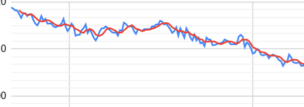

# 設計ワークショップ（ヘルスケアアプリ：体重＋専門家チャット）

今回は以下の要件で設計を進めます。

## 1. ビジネス背景・目的

* ユーザーの**体重推移の見える化**と、**専門家への相談**をWebアプリで提供する。
* 毎日の体重計データを**すべて保存**しつつ、画面表示は**日ごとの最新値**＋**移動平均**を併記。
* 初期リリースでは**食事記録・決済・予約・ビデオ通話・外部医療機関連携**などは対象外。
* ログインやユーザ情報も最小限（今回のスコープ外）

イメージ図

---

## 2. システムの想定ユーザー

| 役割      | 主な操作               | 備考        |
| ------- | ------------------ | --------- |
| 一般ユーザー  | 体重登録／履歴閲覧、専門家に相談   | モバイル／Web  |
| 専門家（複数） | 相談対応      | 事業者側アカウント |

---

## 3. 基本業務フロー（最小要件）

1. **体重データ登録**

   * ユーザーが体重と測定時刻を送信。**全件保存**（履歴保持）。
   * タイムゾーンを考慮し**ローカル日付**を算出。
2. **時系列の閲覧**

   * 期間切替：**1週間／1ヶ月／3ヶ月／半年／1年**
   * **日ごとの最新値**と**移動平均**を同時表示。
3. **専門家チャット**

   * ユーザーが相談ルームを作成。
   * 複数専門家が参加可能。テキスト送受信（画像添付は任意）。

---

## 4. データと業務ルール（必須）

| 区分     | ルール／仕様                                                   |
| ------ | -------------------------------------------------------- |
| 体重（保存） | 投稿された計測データは**削除せず全て保存**。`UTC`で保存し、表示時にユーザーTZへ変換。         |
| 体重（表示） | **同一ローカル日付の中で最も新しい1件**を「その日の体重」として採用。                    |
| 期間     | 直近 **7/30/90/182/365 日**のローリング期間を切替表示。                   |
| 移動平均   | 初期は**7日SMA（後方）**。欠測日は平均対象外（取得できた日のみ）。                    |
| 入力手段   | 手動入力／対応デバイスからの送信。 |
| チャット   | ルーム単位で管理。参加者は**ユーザー1名＋専門家（複数可）。既読・削除は記録（監査用）。     |

---